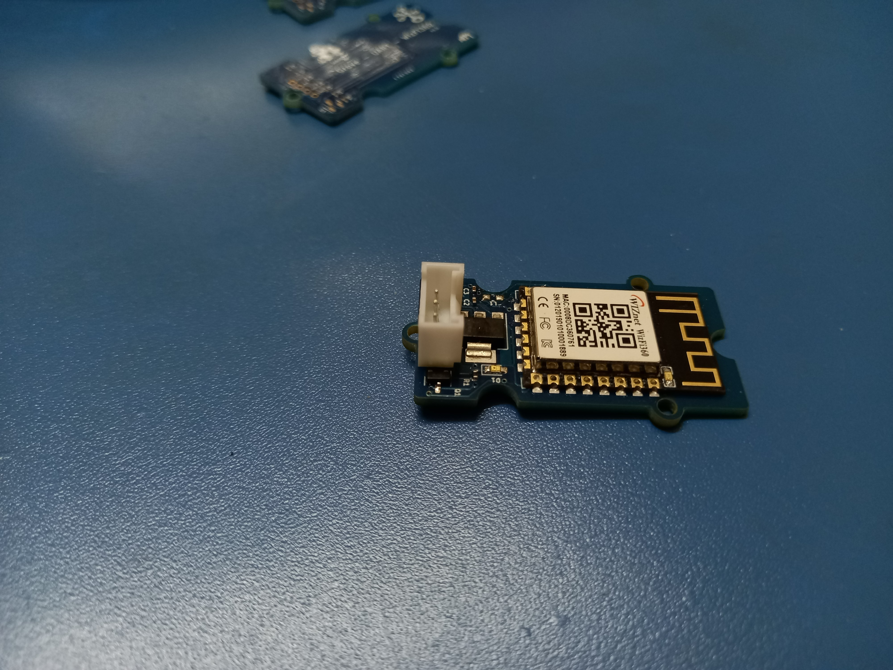
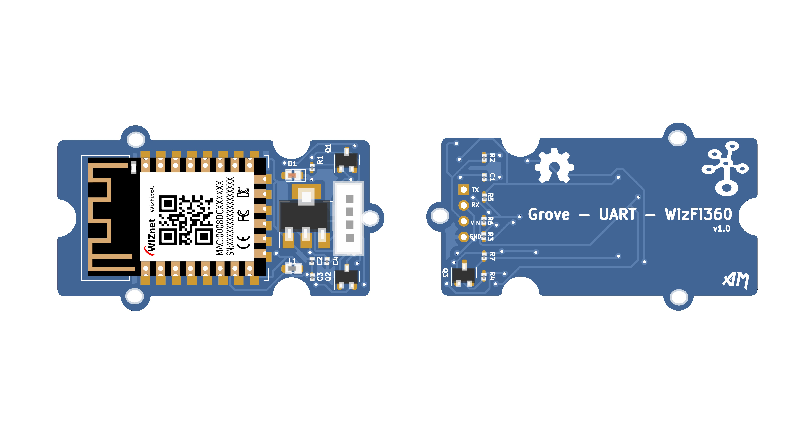
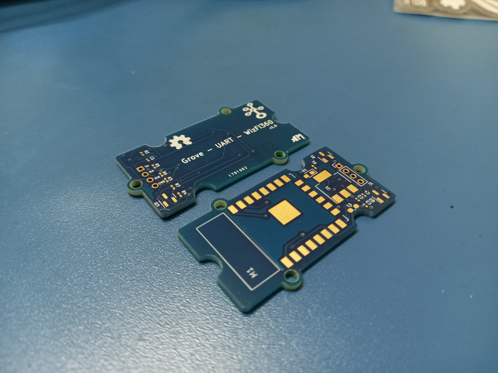
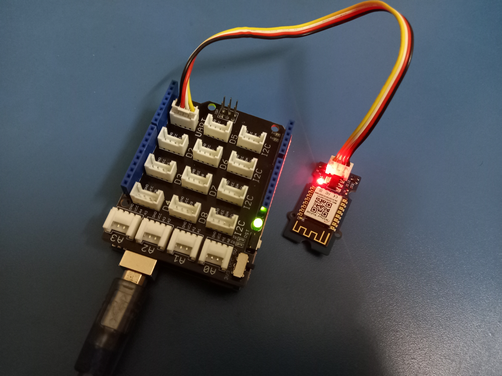

# Grove_WizFi360

Grove - UART - WizFi360 is a serial transceiver module featuring the WizNet's WizFi360 WiFi module .With integrated TCP/IP protocol stack, this module lets your micro-controller interact with WiFi networks with only a few lines of code. Each WizFi360 module comes pre-programmed with an AT command set firmware, meaning you can send simple text commands to control the device.
 
Connectivity is provided via 2.4Ghz wireless connection, WizFi360 is compatible with IEEE802.11 b/g/n standards and supports SoftAP, Station and SoftAP+Station modes.

Design Files: This project is designed using Open Source KiCad .Design files are located [here](https://github.com/amalmathewtech/Grove_WizFi360/tree/main/kicad_design_files)

You can download Schematics from [here](https://github.com/amalmathewtech/Grove_WizFi360/tree/main/schematics)

This work is licensed under the MIT License

Made With ❤ in OpenSource
